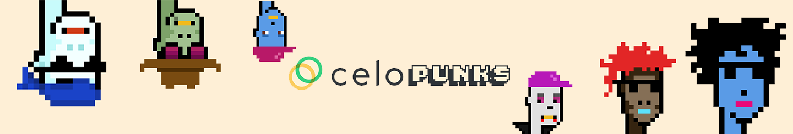

# Celo Punks Subgraph



### How to use the API

Try it out [here](https://thegraph.com/hosted-service/subgraph/nestorbonilla/celo-punks)

Example query:

```graphql
{
  tokens(first: 5) {
    id
    tokenID
    tokenURI
    ipfsURI
  }
}
```

Filtering

```graphql
{
  tokens(
    where: {
      type: "Human"
    }
  ) {
    
    id
    tokenID
    tokenURI
    ipfsURI
    name
    type
  }
}
```

### How to deploy the API

This project is an example of how you can build and deploy Graph Protocol APIs for NFT projects.

This subgraph indexes data from [Celo Punks](https://explorer.celo.org/address/0x9f46B8290A6D41B28dA037aDE0C3eBe24a5D1160) smart contract transactions and makes them queryable.

To deploy this API, follow these steps:

1. Clone this repo.
2. Install the dependencies.

```sh
git clone git@github.com:nestorbonilla/celo-punks-subgraph.git

cd celo-punks-subgraph

yarn install
```

1. Go to The Graph [hosted service dashboard](https://thegraph.com/hosted-service/), create a profile, and create a new subgraph.

2. Install The Graph CLI:

```sh
npm install -g @graphprotocol/graph-cli
```

4. Authenticate the your CLI environment with the __Access Token__ from your account dashboard:

```
graph auth https://api.thegraph.com/deploy/ <ACCESS_TOKEN>
```

5. Replace `username/apiname` in `package.json` with your username and apiname, for example: `nestorbonilla/celo-punks`

6. Deploy the subgraph

```sh
yarn deploy
```